# Welcome to BeerCollector!

#### This is an individual project assignment for the course "Python Web Framework" at SoftUni

# 
  

### Abstract

This web application is designed for all beer lovers. For those who want to collect and share their favorite styles of
beer, beer brands, and pubs.

### Table of Contents

* [1. Introduction](#chapter1)
* [2. Website Overview](#chapter2)
    * [2.1. Users and Profiles](#section_2_1)
        * [2.1.1. Anonymous User](#section_2_1_1)
        * [2.1.2. Registered User](#section_2_1_2)
        * [2.1.3. Administrative User](#section_2_1_3)
        * [2.1.4. Profile Characteristics](#section_2_1_4)
    * [2.2. Beer Styles](#section_2_2)
        * [2.2.1. Beer Style Characteristics](#section_2_2_1)
        * [2.2.2. Beer Style Likes](#section_2_2_2)
        * [2.2.3. Beer Style Comments](#section_2_2_3)
    * [2.3. Beer Labels](#section_2_3)
        * [2.3.1. Beer Label Characteristics](#section_2_3_1)
        * [2.3.2. Beer Label Likes](#section_2_3_2)
        * [2.3.3. Beer Label Comments](#section_2_3_3)
    * [2.4. Pubs](#section_2_4)
        * [2.4.1. Pub Characteristics](#section_2_4_1)
        * [2.4.2. Pub Likes](#section_2_4_2)
        * [2.4.3. Pub Comments](#section_2_4_3)
* [3. Mandatory requirements](#section_3)
* [4. Tests Coverage](#section_4)
* [5. Additional Developments](#chapter5)

### 1. Introduction 

Website users have the opportunity to create their own accounts and publish their favorite beer brands, beer styles, and
pubs. Each post can be liked and commented on by other users. Each user collects their own posts and likes from other
users.

### 2. Website Overview 

Both registered and unregistered users have access to the website.

Unregistered users have the opportunity to view only the posts of registered users, and they cannot like or comment on
the posts.

Registered users have the opportunity to create their own profiles and make posts. They can also put a comment below
their own posts, but can't say they like it.

In the following described in detail the functionality of the objects.

#### 2.1. Users and Profiles 

A ***Custom User Model*** has been implemented to create a user objects so that the email address can be used as the
primary user ID instead of the authentication username.

The user objects have relational connections to all other objects in the project.

In terms of registration, users are:

- Anonymous User
- Registered users
- Administrative users

The accounts (profiles) objects have a relational connection "OnetoOne" with pre-created users.

##### 2.1.1 Anonymous User 

The ***anonymous user*** has permission to view only all public post and their details. This user has restricted access
to the navigation bar. He is able to register in the website with an email and password. The registration includes an
email verification process. Once this user has registered and logged in to the website he has access to the rest of the
functionality.

# 
 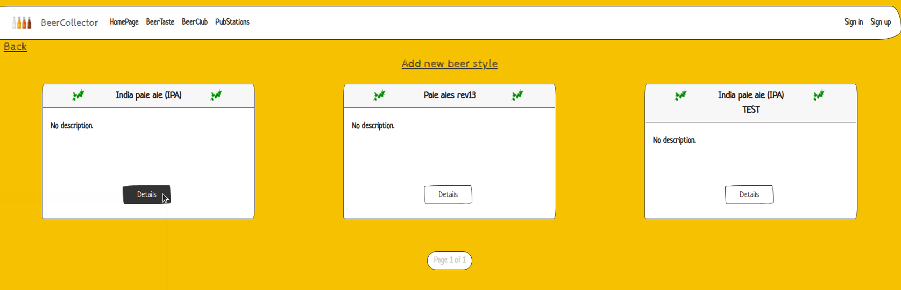 

##### 2.1.2 Registered User 

The ***registered user*** is already registered and can log in with an email and password. After his authentication, the
user is able to navigate through the navigation bar. The registered user has his own profile with a username, image,
first name, last name, and information about himself. This user has all CRUD permissions to his own posts. He can like
and comment on all public posts in the system.

# 
 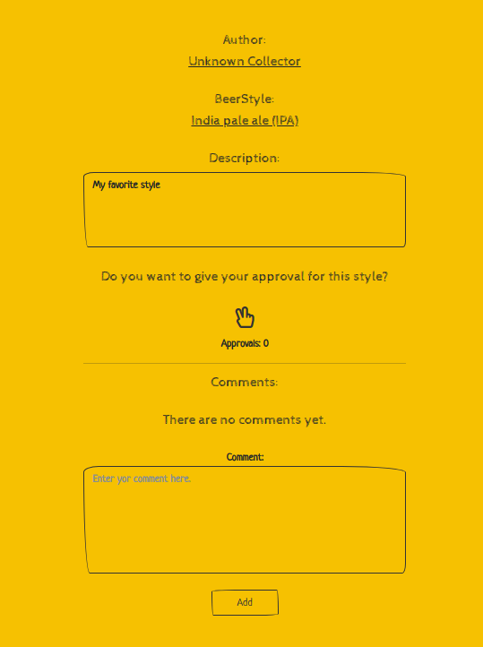 

##### 2.1.3 Administrative User 

The ***administrative user*** gets enabled through the admin site by the superuser. His 'is_staff' field is set to True.
This user has all CRUD permissions over other users and their posts in the database.

# 
 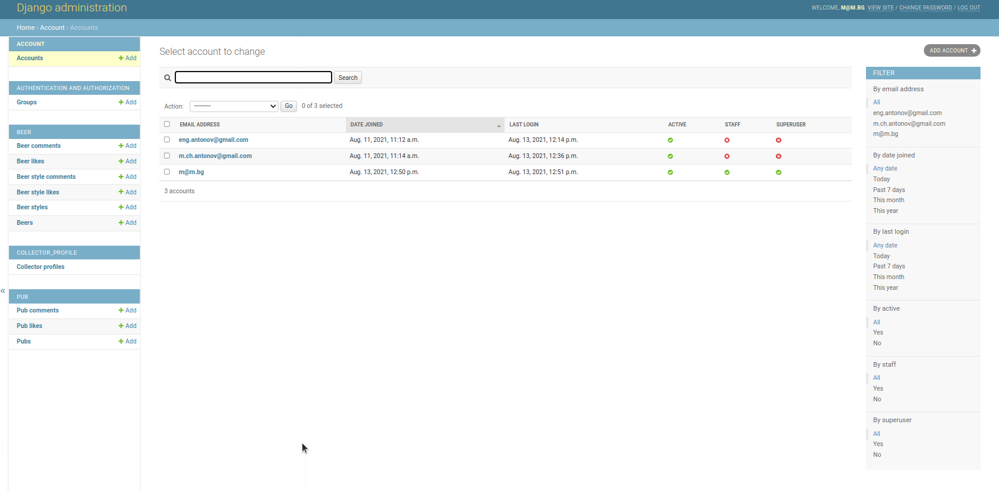 

##### 2.1.4 Profile Characteristics 

Every registered user has an account ***(profile)***. The profile allows the user to change his password, to update his
own information and to delete his own account. The profile page shows the completion of the user's profile and his
collections. The ***profile*** can be completed up to 100% after all fields in the form are filled out.

The ***profile*** has the following fields:

- username - CharField with max length 20 chars
- first name - CharField with max length 20 chars
- last name - CharField with max length 20 chars
- about - CharField with max length 300 chars
- image - ImageField

# 
 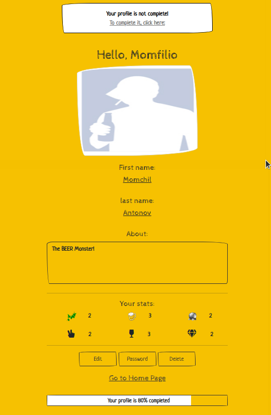 

#### 2.2. Beer Styles 

The ***beer style*** could be either public or private. It can be viewed by all types of users but created, edited, and
deleted only by its author. The author can put comments but can't like his own ***beer style***. Only the other users
can like it.

##### 2.2.1 Beer Style Characteristics 

The ***beer style*** has the following fields:

- type - CharField with max length 30 chars
- description - CharField with max length 300 chars
- user - ForeignKey relation with user

# 
 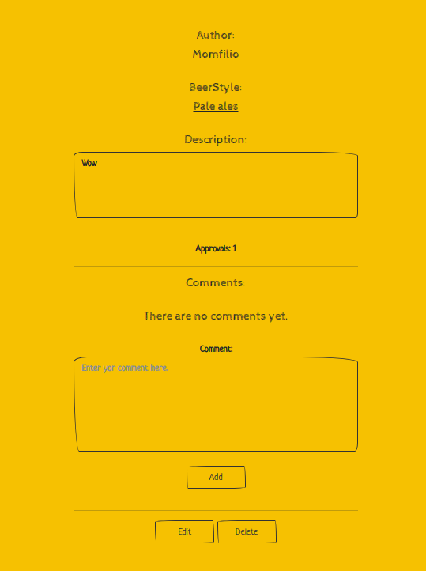 

##### 2.2.2 Beer Style Likes 

The ***beer style like*** could be either public or private. It can be viewed by all types of users. The author and
anonymous users can't like the ***beer style***. Only the other users can like it. Once the like object is created by a
single user, it can be only deleted when clicked again.

The ***beer style like*** has the following fields:

- beer style - ForeignKey relation with beer style
- user - ForeignKey relation with user

# 
 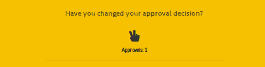 

##### 2.2.3 Beer Style Comments 

The ***beer style comment*** could be either public or private. It can be viewed by all types of users. The anonymous
users can't comment on the ***beer style***, only the other users can.

The ***beer style comment*** has the following fields:

- comment - TextField
- beer style - ForeignKey relation with beer style
- user - ForeignKey relation with user

# 
 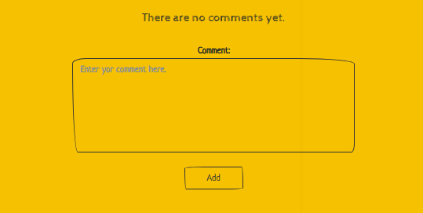 

#### 2.3. Beer Labels 

The ***beer label*** could be either public or private. It can be viewed by all types of users but created, edited, and
deleted only by its author. The author can put comments but can't like his own beer label. Only the other users can like
it.

##### 2.3.1 Beer Label Characteristics 

The ***beer label*** has the following fields:

- label - CharField with max length 30 chars
- type - ForeignKey relation with beer style
- description - CharField with max length 300 chars
- image - ImageField
- user - ForeignKey relation with user

# 
 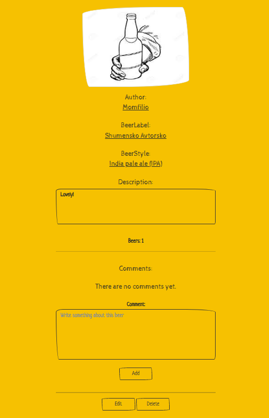 

##### 2.3.2 Beer Label Likes 

The ***beer label like*** could be either public or private. It can be viewed by all types of users. The author and
anonymous users can't like the ***beer label***. Only the other users can like it. Once the like object is created by a
single user, it can be only deleted when clicked again.

The ***beer label like*** has the following fields:

- beer label - ForeignKey relation with beer label
- user - ForeignKey relation with user

# 
  

##### 2.3.3 Beer Label Comments 

The ***beer label comment*** could be either public or private. It can be viewed by all types of users. The anonymous
users can't comment on the ***beer label***, only the other users can.

The ***beer label comment*** has the following fields:

- comment - TextField
- beer label - ForeignKey relation with beer label
- user - ForeignKey relation with user

# 
 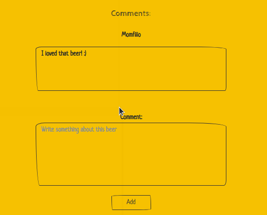 

#### 2.4. Pubs 

The ***pub*** could be either public or private. It can be viewed by all types of users but created, edited, and deleted
only by its author. The author can put comments but can't like his own ***pub***. Only the other users can like it.

##### 2.4.1 Pub Characteristics 

The ***pub*** has the following fields:

- name - CharField with max length 30 chars
- address - CharField with max length 60 chars
- description - CharField with max length 300 chars
- website - URLField
- image - ImageField
- longitude - DecimalField with max digits 9, decimal places 6
- latitude - DecimalField with max digits 9, decimal places 6
- user - ForeignKey relation with user

# 
 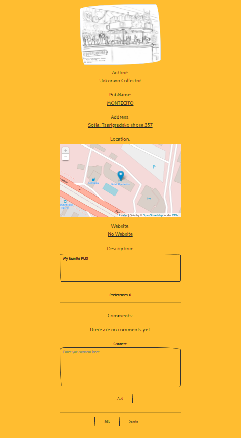 

##### 2.4.2 Pub Likes 

The ***pub like*** could be either public or private. It can be viewed by all types of users. The author and anonymous
users can't like the ***pub***. Only the other users can like it. Once the like object is created by a single user, it
can be only deleted when clicked again.

The ***pub like*** has the following fields:

- pub - ForeignKey relation with beer pub
- user - ForeignKey relation with user

# 
 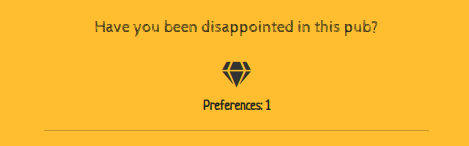 

##### 2.4.3 Pub Comments 

The ***pub comment*** could be either public or private. It can be viewed by all types of users. The anonymous users
can't comment on the ***pub***, only the other users can.

The ***beer label comment*** has the following fields:

- comment - TextField
- pub - ForeignKey relation with pub
- user - ForeignKey relation with user

# 
 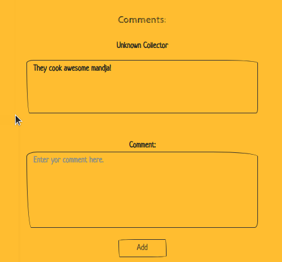 

### 3. Mandatory requirements 

- [x] The application must be implemented using Django Framework
- [x] The application must have at least 10 endpoints
- [x] The application must have login/register functionality
- [x] The application must have public part (A part of the website, which is accessible by everyone – un/authenticated
  users and admins)
- [x] The application must have private part (accessible only by authenticated user and admins)
- [x] The application must have admin part (accessible only to admins)
- [x] Unauthenticated users (public part) have only 'get' permissions e.g., landing page, details, about page
- [x] Authenticated users (private part) have full CRUD for all their created content
- [x] Admins have full CRUD functionalities
- [x] Form validations
- [x] To avoid crashes, implement Error Handling and Data Validations
- [x] Use PostgreSQL as a database.
- [x] Write tests for at least 60% coverage on your business logic
- [x] Templates (your controllers/views must return HTML files) – one and the same template could be re-used/used
  multiple times (with the according adjustments, if such needed)
- [x] Use a source control system by choice – Github or Gitlab. You must have at least 5 commits + README

### 5. Tests Coverage 

#### Account tests

# 
 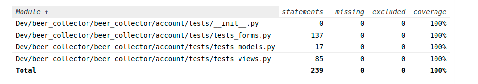 

#### Beer Style and Beer Label tests

# 
 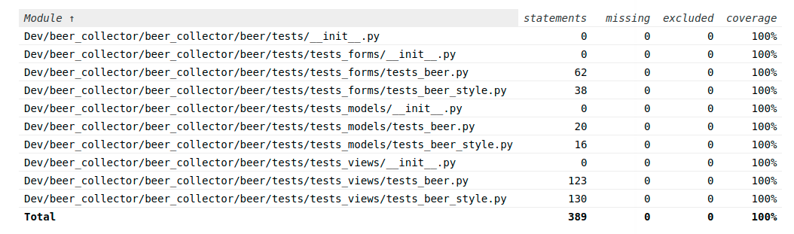 

#### Pub tests

# 
 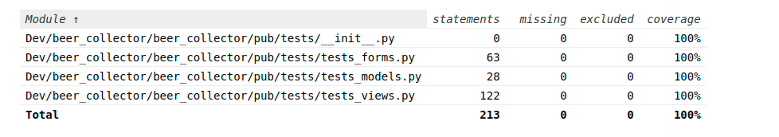 

#### Profile tests

# 
 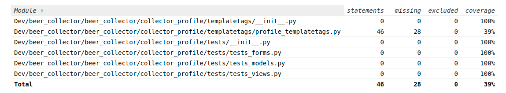 

### 5. Additional Developments 

- [x] Responsive web design
- [x] Class-based views
- [x] Extended Django user
- [ ] Documentation/ Swagger
- [ ] Use a file storage cloud API e.g., Cloudinary, Dropbox, Google Drive or other for storing the files
- [ ] Implement Microservice architecture in your application.
- [ ] Additional functionality, not explicitly described in this section, will be counted as a bonus if it has practical
  usage.